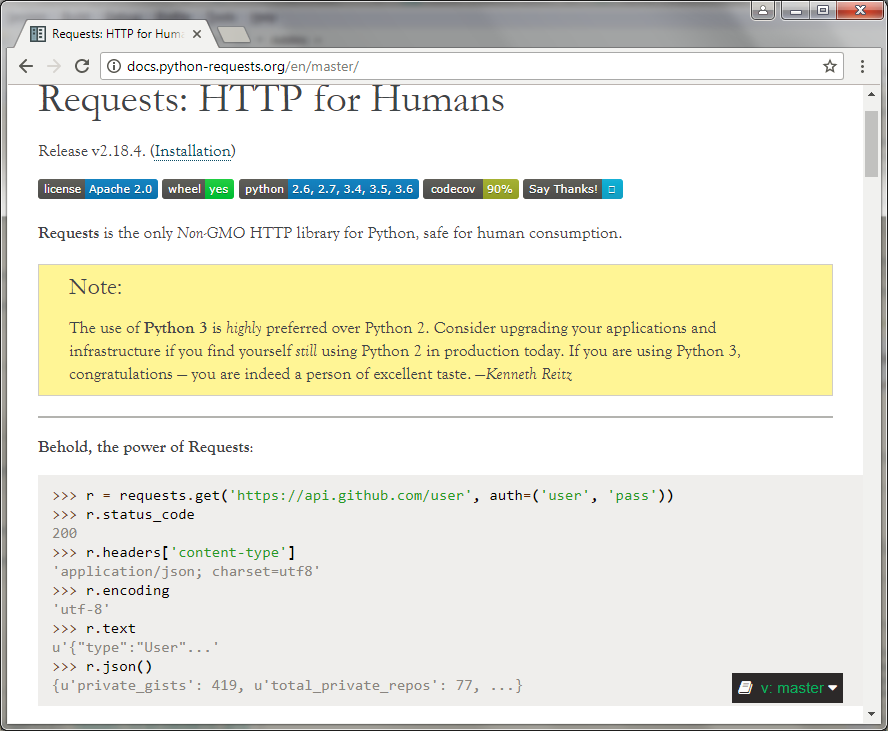

```{r include=FALSE}
knitr::opts_chunk$set(
  echo = FALSE
  , out.height = '500px'
)
```


# What is Python?

## What is Python?

Python is a programming language invented by ...

## ... this guy

```{r out.height='600px'}
knitr::include_graphics('images/guido_von_rossum.jpg')
```

##

... and he named it Python because ...

## ... he was into Monty Python when he wrote it

```{r}
knitr::include_graphics('images/monty_python.jpg')
```

## What can it do?

* Interpreted program, like R or VBA
* Runs on any OS
* Comes standard on Mac and Linux
* General programming
* Access the file system

## How does it do it?

The Zen of Python

* Beautiful is better than ugly.
* Explicit is better than implicit.
* Simple is better than complex.
* Complex is better than complicated.
* Flat is better than nested.
* Sparse is better than dense.

## More zen

* Readability counts.
* Special cases aren't special enough to break the rules.
* Although practicality beats purity.
* Errors should never pass silently.
* Unless explicitly silenced.
* In the face of ambiguity, refuse the temptation to guess.
* There should be one-- and preferably only one --obvious way to do it.

# What else does it do?

## Analytic data


<div class='left'>
```{r}

```
</div>

<div class='right'>
```{r}

```
</div>

## Visualization

<div class='left'>
```{r}

```
</div>

<div class='right'>
```{r }

```
</div>

## Data from the web

<div class='left'>
```{r out.width='500px', out.height='450px'}

```
</div>

<div class='right'>
```{r out.width='500px', out.height='450px'}

```
</div>

## Other cool web stuff

```{r out.height='600px'}

```

## Data science

<div class='left'>
```{r}

```
</div>

<div class='right'>
```{r}

```
</div>

# How can I incorporate Python into my workflow?

## Similarities between R and Python

* FLOSS - Free, Libre, Open Source Software
* Wide support (take that, Julia!)
* Interpreted, REPL
* Rich package ecosystem
* Not OS dependent
* Fast to program
* Execution not always as fast as C, but possible to use C routines when needed
* great database support - from RDBMS to Spark, Hadoop, etc.

## How does it compare with R?

<div class='left'>
R ...

* loves statistics
* hasn't really settled on OOP
* vector support out of the box
* does anyone really use `try()`?
* has some actuarial packages
* RStudio!!!
* lacks consensus around machine learning - H2O, caret, ROCR?
</div>

<div class='right'>
Python ...

* is general purpose
* has easy and consistent support for OOP
* vectors are available in `numpy`
* great exception handling
* not much actuarial focus
* no consensus on a FLOSS IDE
* scikit-learn!
</div>

## Compare with Excel?

<div class='left'>
Excel ...

* Closed source, paid commercial license
* Data is visible, but logic is hidden
* Great for camera-ready output
</div>

<div class='right'>
Python ...

* FLOSS
* Logic is visible, data is abstract
* A bit more work to document output
</div>

## Practicalities

* Version 2 or 3?
    * Used to be an issue, but not much anymore
    * Version 2 is going away after a VERY long transition
* Editor?
    * Can just code at the console or copy and paste
    * A few decent FLOSS choices: Spyder, Rodeo
    * The best options are commercial
* Can I e-mail a python file to a co-worker?

## Jupyter

<div class='left'>
```{r}

```
</div>

<div class='right'>
* Framework for interactive use of programming languages
* Support for several different languages
* Files - "notebooks" - may be shared with other users
* Methodology is transparent and reproducible
</div>

# Intro scikit learn

## scikit-learn

* Built on NumPy, SciPy, and matplotlib
* Open source, commercially usable - BSD license
* Common functional interface for:
    * Data splits, cross validations
    * Data transforms
    * Training, test, scoring
    * Pipelines to manage workflow
    * GridSearch for model tuning

## But what algorithms does it support?


## Estimators

* Estimators are the building block of scikit-learn.  Almost everything is an estimator.
* All estimators have fit() and predict() methods.
* Supervised techniques generally have a score() method as well.
* Some special estimators have a transform() method to pre-process data.
    * Generate new features
    * Clean data
    * Other pre-processing

## Pipelines


* Preprocess (transform()) my data
* Dimensionality reduction (PCA, cluster, etc.)
* Steps may be cached to save memory
* Awesome for grid search to shrink the potential parameter space
* The final step of the pipeline is fit()

## Add it up

1. Estimators are objects which have a common function interface
2. I can transform my data to make it ready to fit
3. I can easily swap between estimators knowing that they all have fit() and predict() methods
4. I capture my workflow in a pipeline

# How about an example?

# Wrapping up

## Python and you

* If you already know R, check out Python
* If you don't know R, check out Python
* If you're an actuary, check out Python
* Jupyter is a great place to start experimenting
* scikit-learn is worth exploring

## Thank you for your time!

## Questions?

## References

* http://scikit-learn.org/stable/
* https://www.python.org/
* https://www.python.org/dev/peps/pep-0020/
* [Data Camp numpy cheat sheet](https://s3.amazonaws.com/assets.datacamp.com/blog_assets/Numpy_Python_Cheat_Sheet.pdf)
* http://docs.python-requests.org/en/master
* https://pandas.pydata.org/about.html
* http://www.statsmodels.org/stable/index.html
* http://ggplot.yhathq.com
